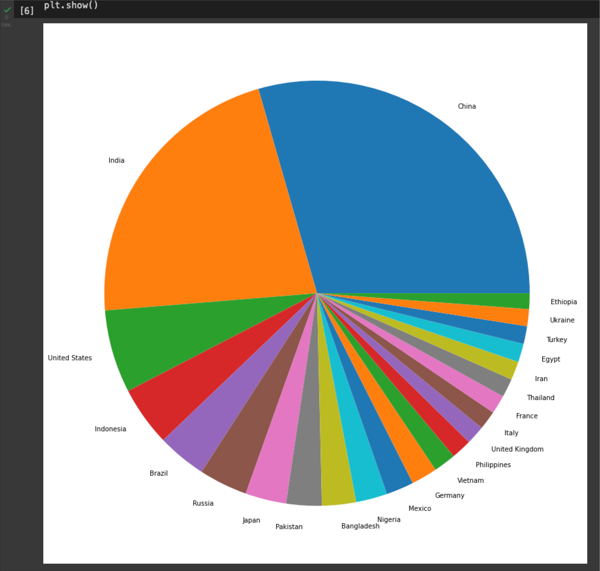
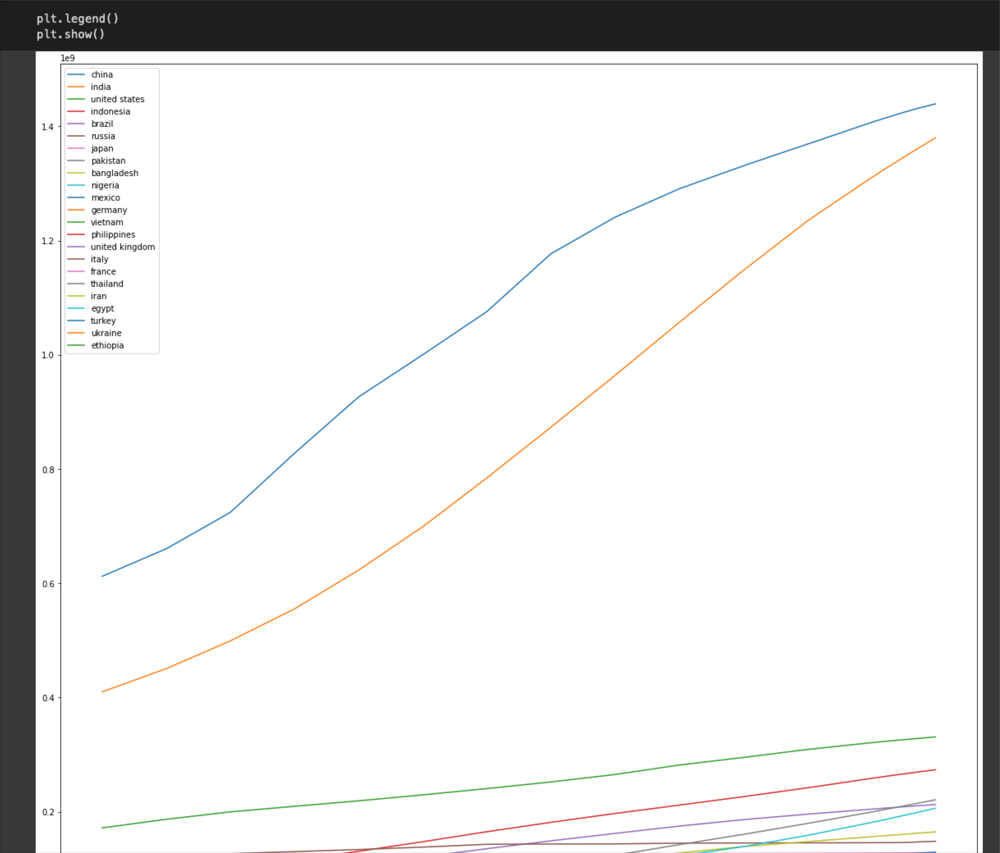
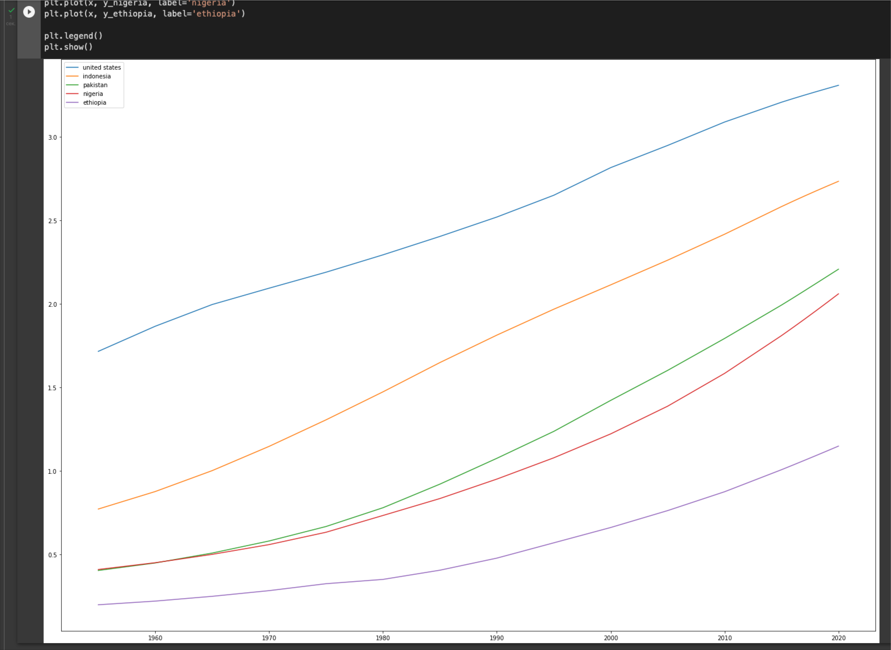
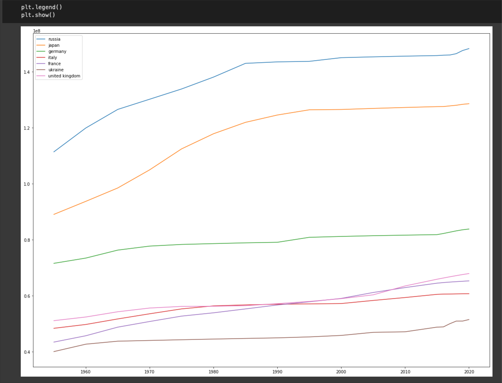
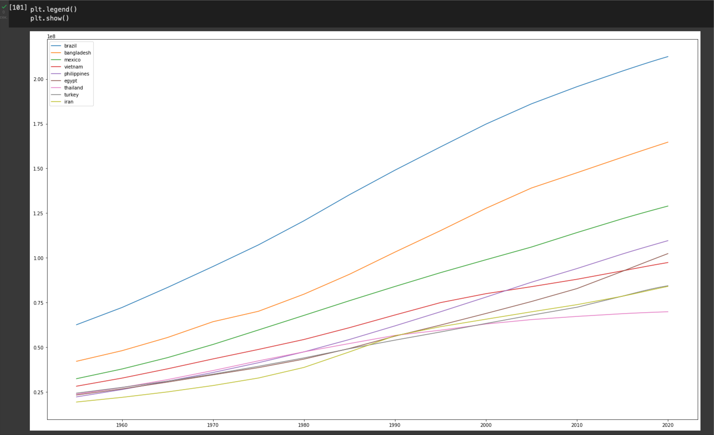

# домашнее задание к уроку №11
"Проанализировать любой датасет, который вам нравится (например, Титаник), найти интересные факты и зависимости, визуализировать результаты если получится."

Для работы выбран датасет population_total, содержащий статистику по динамиике населения в странах с 1950 года.
В целевую группу отобраны 23 наиболее населенных государств. Сравнив характер линий с графиков динамики населения, были выделены 3 группы.

В представленном графике  можно видеть, что более половины массы населения, рассматриваемой группы, принадлежит двум страннам: Китаю и Индии. Разрыв с население других стран здесь так велик, что можно рассматривать эти траны как пару, отдельно от остальных стран.

На графике с кривыми прогресса наслеления   хорошо видно, что вплоть до 90-х годов линии Китая и Индии шли круто вверх параллельно друг другу, но в 90-х темпы роста населения в Китае заметно замедляются, в верхней части графика кривые уже теряют свой паралельность и начинают сближение. Индийская продолжает свой неуклонных рост до настоящего времени, китайская меняет угол на более пологий, и за последние 30 лет он уже не меняется, что говорит об перманентности произошедших изменений и устойчивости настоящих тенденций.

Третья по численности страна - США, угол подъема кривой  увеличения насления Китая после 90-ых годов очень близок к линии США, неизменной на всем отрезке наблюдений. Можно выделить группу стран, население которых увеличиватся с теми же постоянными темпами как в США: Соединенные Штаты, Индонезия, Пакистан, Нигерия и Эфиопия.

Удивительным образом другую пару со схожими характерами кривых роста населения составляют Россия и Япония . Они уже не так прямолинейны как в группе США, но повторяют колебания друг друга, образуя заметную параллельность. И также отличны от кривых других наблюдаемых стран. До середины 80-х годов угол подъема этих линий был близок к группе США, но дальше он снижается, становится пологим и равняется с темпами роста европейских стран. В целом сегодня их можно объединить в европейскую группу, объединенную низкими темпами роста населения. В нее входят: Россия, Япония, Германия, Италия, Франция, Украина и Великобритания.

Другую группу линий темпов роста населения, близку к группе США по величине наклона, крутезне кривой  , возглавляет Бразилия. Для данной группы характерно, что в 60-х, 70-х гг. темпы роста незначительно, но синхранной увеличиваются, а в 90-х, 2000-х гг. возвращаются к прежним значениям. В бразильскую группу входят: Бразилия, Бангладеш, Мексика, Вьетнам, Филлипины, Египет, Таиланд, Турция и Иран.