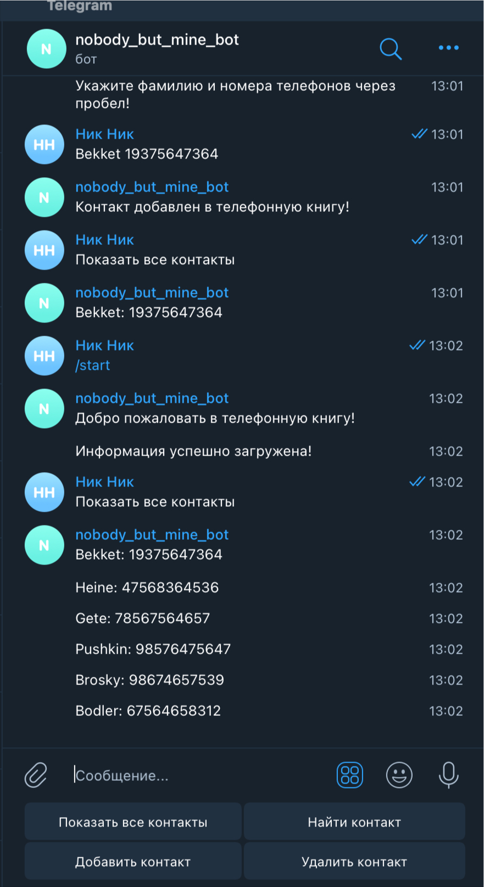

# telegram bot with phonebook
Phonebook - это телеграм-бот для работы с телефонной книгой: поиск контактов, добавление новых, редактирование.
- Подгрузка базы данных телефонной книги осуществляется по команде /start.
- Пока не выполнена команда /start кнопка "Показать все контакты" выводит в сообщении только контакты, созданные в данную сессию. 
Но все новые контакты автоматически добавляются в json файл.
- Команда /start парсит и подгружает json файл с базой данных телефонной книги и 
кнопка "Показать все контакты" будет демонстрировать уже обновленный список контактов. 
### Для локального запуска бота выполнить слудующие действия:
```
pip install telebot
pip install PyTelegramBotAPI==2.2.3
pip install PyTelegramBotAPI==3.6.7
```
в файле get_number_value.py в 14-ой строке переменной API_TOKEN присвоить значение ключа, полученного от BotFather
```
API_TOKEN = 'Апи ключ, который вы получили у BotFather'
```
### Запуск
Чтобы запустить бота, выполните в консоли:
```
python3 bot.py
```